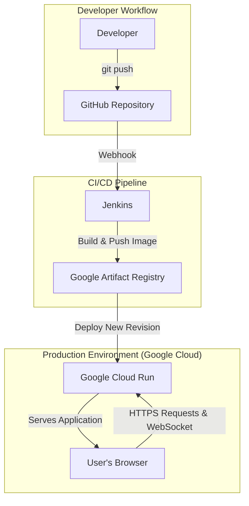
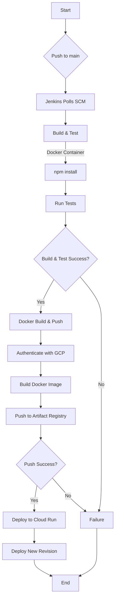

# 🚀 MessageApp: A DevOps Project

This project demonstrates a complete CI/CD (Continuous Integration/Continuous Deployment) pipeline for a simple Node.js web application. The pipeline is orchestrated by Jenkins and deploys the application as a container to Google Cloud Run.

---

## 🌟 Features

-   **Simple Node.js Web Application:** A lightweight web server built with Express.js.
-   **Containerized with Docker:** The application is containerized using Docker for portability and consistency.
-   **Automated CI/CD Pipeline:** A complete CI/CD pipeline managed by a `Jenkinsfile`.
-   **Deployment to Google Cloud Run:** The application is automatically deployed to Google Cloud Run, a serverless platform.
-   **Infrastructure as Code:** The entire pipeline is defined as code in the `Jenkinsfile`.

---

## 🛠️ Tech Stack


---

## 🏗️ Infrastructure Diagram

This diagram provides a visual representation of the project's infrastructure.



---

## 🔧 Local Development

To run the application on your local machine, you'll need [Node.js](https://nodejs.org/) and [Docker](https://www.docker.com/get-started) installed.

1.  **Clone the repository:**
    ```bash
    git clone https://github.com/pallavihere/devops-project.git
    cd devops-project
    ```

2.  **Install dependencies:**
    ```bash
    npm install
    ```

3.  **Run the application:**
    ```bash
    npm start
    ```

The application will be available at `http://localhost:3000`.

---

## 🌊 CI/CD Pipeline Flowchart

This flowchart visualizes the entire CI/CD process, from a code change to a successful deployment.



### Pipeline Stages Explained

1.  **Checkout**: Jenkins checks out the latest code from the `main` branch of the Git repository.
2.  **Build & Test**: This stage runs inside a `node:18-alpine` Docker container. It installs the Node.js dependencies and runs tests (if any are configured).
3.  **Docker Build & Push**: This stage builds a Docker image of the application and pushes it to Google Artifact Registry. It first authenticates with Google Cloud using a service account.
4.  **Deploy to Cloud Run**: This stage deploys the new Docker image to Google Cloud Run, making the updated application available to the world.

---

## 🌐 API Endpoints

The application has two main endpoints:

-   `GET /`: Serves the static HTML homepage.
-   `GET /api/message`: Returns a JSON response.
    ```json
    {
      "message": "Hello from Dockerized CI/CD pipeline!"
    }
    ```

---

## 🔮 Future Improvements

-   **Implement a proper testing framework:** Add a testing framework like Jest or Mocha to the `Build & Test` stage to run automated tests.
-   **Introduce a staging environment:** Add a staging environment to the pipeline to test the application before deploying to production.
-   **Use webhooks for build triggers:** Switch from SCM polling to GitHub webhooks for more efficient and faster build triggers.
-   **Implement secrets management:** Use a secrets management tool like HashiCorp Vault or Google Secret Manager to manage secrets more securely.

---

## ⚖️ License

This project is licensed under the MIT License - see the `LICENSE` file for details.